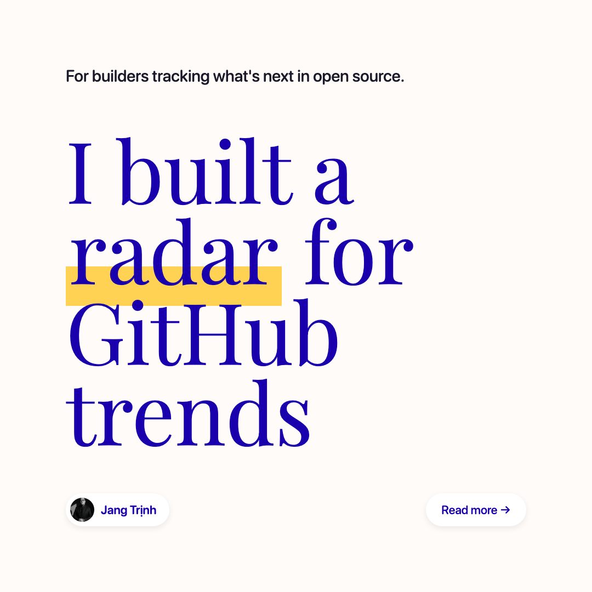
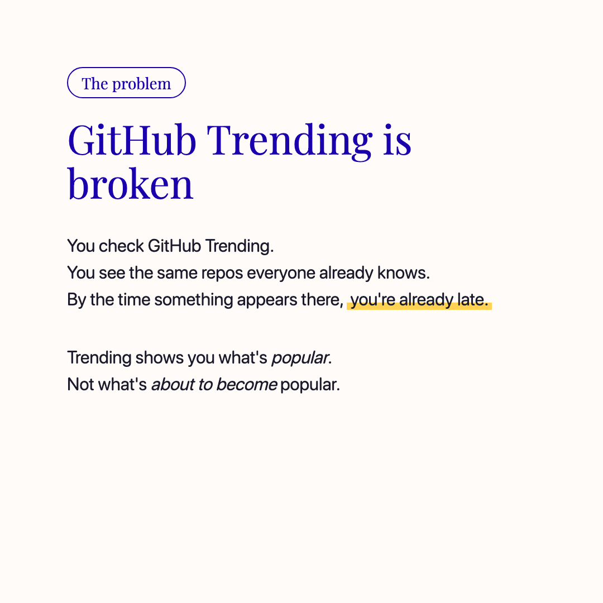
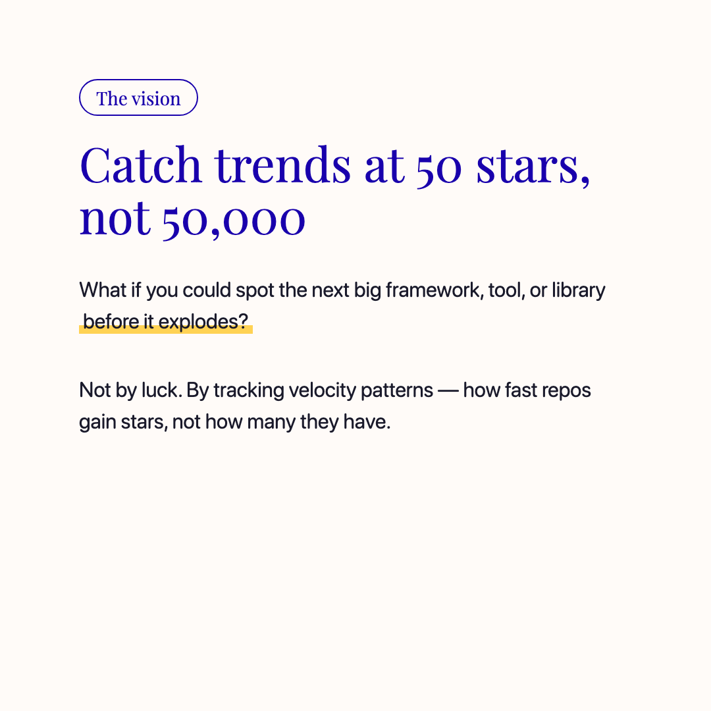
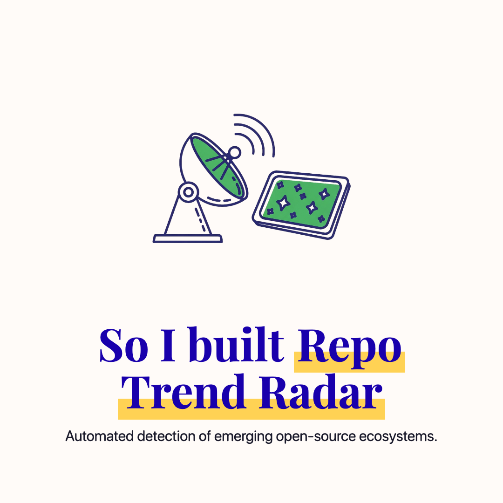
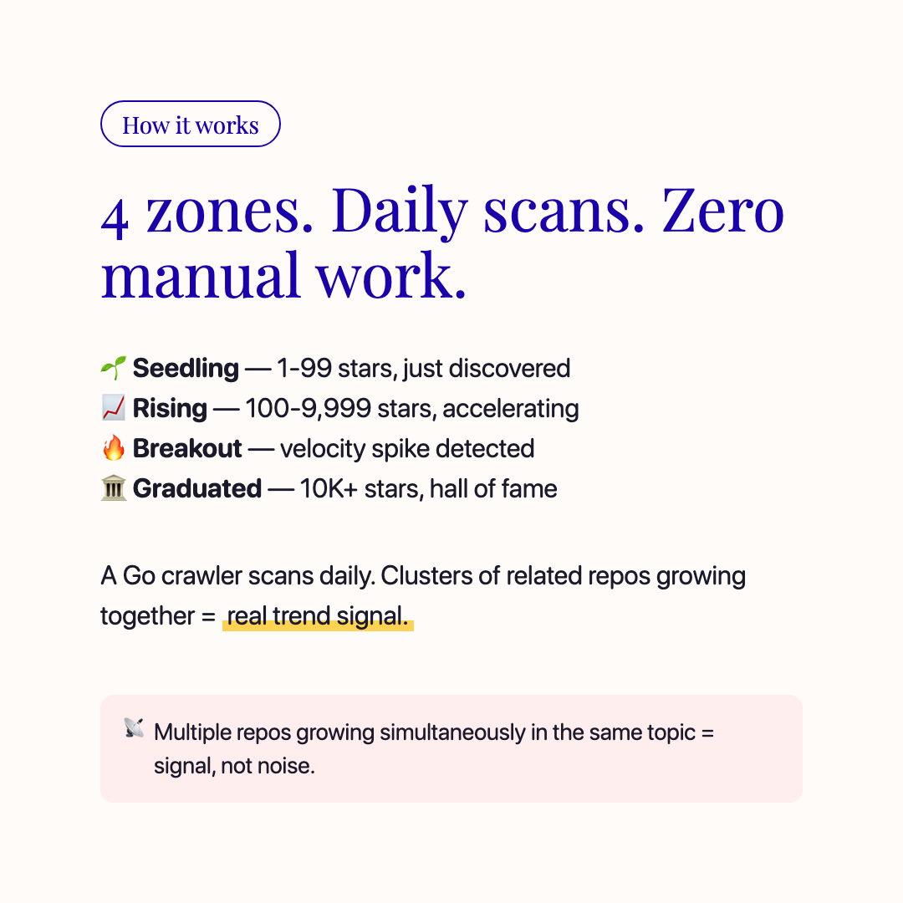

# 📡 Repo Trend Radar

> **For builders tracking what's next in open source.**

Automated detection of emerging open-source technology ecosystems by analyzing GitHub repository growth patterns across topics.

<p align="center">
  
  
  
</p>
<p align="center">
  
  
  
</p>
<p align="center">
  
</p>

---

## ✨ Features

- 🔍 **Auto-discover** new repos by rotating through seed topics and organic expansion
- 📊 **Track** star velocity across zones: Seedling → Rising → Breakout → Graduated
- 🧬 **Detect** trend clusters — topics where multiple repos grow simultaneously
- 📖 **Analyze** README signals (star charts, "used by" sections, download badges)
- 🎯 **Score** confidence using multi-signal weighting + graduated correlation
- 📋 **Interactive dashboard** — every data point is clickable, TikTok-style README browsing
- 📝 **Scan reports** — automated delta reports after each daily scan

## Architecture

```
┌──────────────┐     ┌──────────┐     ┌──────────────┐
│  Go Crawler  │────▶│  SQLite  │────▶│  JSON Export  │
│  (daily cron)│     │  (WAL)   │     │  (5 files)    │
└──────────────┘     └──────────┘     └──────┬───────┘
                                             │
                                    ┌────────▼────────┐
                                    │  Next.js Static  │
                                    │  (GitHub Pages)  │
                                    └─────────────────┘
```

## Quick Start

```bash
# Clone
git clone https://github.com/easestart/repo-trend-radar
cd repo-trend-radar

# Setup
cp .env.example .env
# Add your GITHUB_TOKEN to .env

# Build crawler
make build

# Run full scan
make scan

# Preview dashboard
cd dashboard && npm install && npm run dev
```

### Fork Configuration

After forking, edit `dashboard/site.config.ts` to customize:

```ts
const siteConfig = {
  githubRepo: 'your-username/repo-trend-radar',
  footer: {
    design:     { label: 'Your Studio', url: null },
    ideation:   { label: 'Your Company', url: null },
    developers: 'Your Team',
  },
};
```

Or set the environment variable `NEXT_PUBLIC_GITHUB_REPO=your-username/repo-trend-radar`.

## Project Structure

```
repo-trend-radar/
├── crawler/              # Go 1.23 module
│   ├── cmd/radar/        # CLI entry (cobra)
│   └── internal/         # Core packages
│       ├── db/           # SQLite + models
│       ├── github/       # REST + GraphQL client
│       ├── scanner/      # Explorer + Tracker + Deep
│       ├── readme/       # Traction signal mining
│       ├── cluster/      # Detection + confidence scoring
│       ├── antigaming/   # Bot detection
│       └── export/       # JSON generator (additive)
├── dashboard/            # Next.js 15 (static export)
│   ├── app/              # Pages (homepage, repos, clusters, graduated)
│   ├── components/       # React components (drawer, charts, table)
│   ├── site.config.ts    # Fork-friendly configuration
│   └── public/data/      # Generated JSON files
├── docs/slides/          # Marketing carousel
├── data/                 # SQLite database (gitignored)
└── .github/workflows/    # CI/CD (daily scan + deploy)
```

## CLI Commands

| Command | Description |
|---------|-------------|
| `radar scan` | Full daily pipeline (all phases) |
| `radar explore` | Discover new repos from seed topics |
| `radar track` | Scan rising + seedling repos |
| `radar analyze` | Deep analysis on hot repos |
| `radar detect` | Run cluster detection |
| `radar export` | Generate JSON for dashboard |
| `radar stats` | Print database statistics |

## Zone System

| Zone | Stars | Scan Frequency | Description |
|------|-------|----------------|-------------|
| 🌱 Seedling | 1-99 | Every 3 days | Recently discovered, watching |
| 📈 Rising | 100-9999 | Daily | Growing, tracking velocity |
| 🔥 Breakout | heat > 0.6 | Daily + deep | Rapid acceleration |
| 🏛️ Graduated | 10,000+ | Archived | Hall of fame, correlation data |

## Dashboard Features

| Feature | Description |
|---------|-------------|
| **Interactive stat cards** | Click any metric to drill down |
| **Clickable charts** | Zone bars & language bars navigate to filtered views |
| **Topic filter** | Filter repos by GitHub topics (llm, rag, ai-agent...) |
| **README drawer** | In-app preview with TikTok-style infinite scroll |
| **Scan reports** | Automated delta reports with new discoveries, zone changes, top movers |
| **Trigger Scan** | One-click button to trigger GitHub Actions workflow |
| **Deep-linkable filters** | Share URLs like `/repos?zone=breakout&language=Rust` |

## License

MIT © [EaseStart](https://github.com/easestart)

---

<p align="center">
  <sub>Design by <a href="https://easeui.design/">EaseUI</a> · Ideation by EaseStart · Developed by Jang, Lucius, Barry</sub>
</p>
